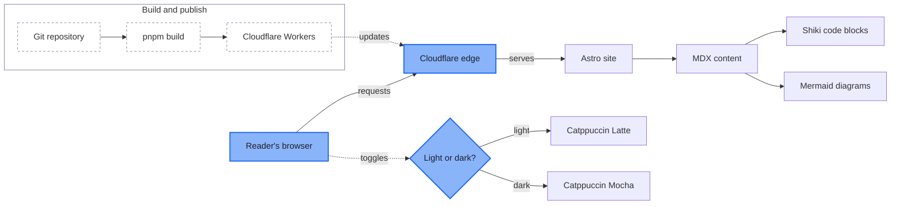
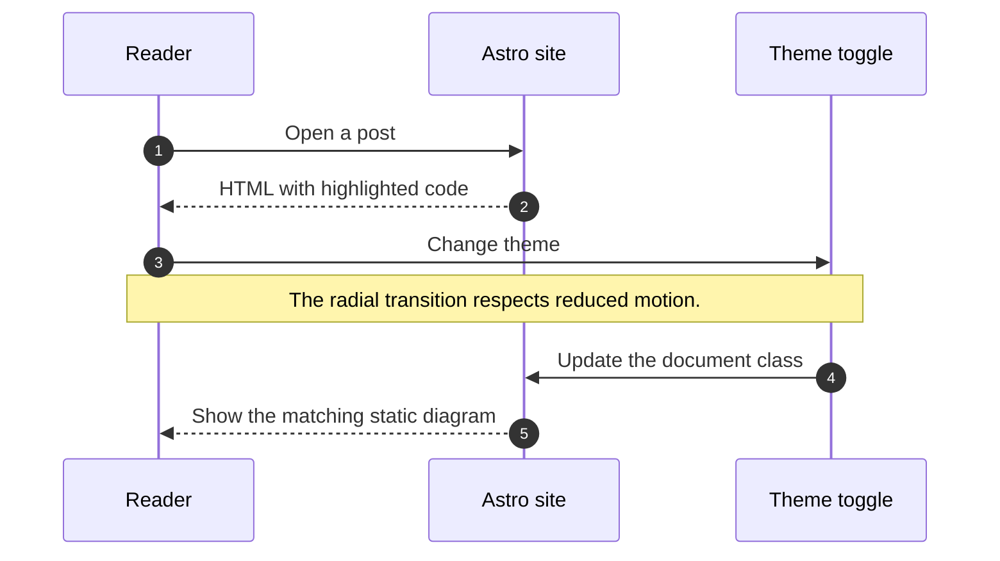

This temporary post exercises the writing stack end to end: plain prose,
[external links](https://astro.build), automatic links such as
https://mroy.me, and [links to another section](#tables).

Text can be _emphasised_, **strong**, ***both***, ~~struck through~~, or
written with `inline code`. A hard line break follows here.  
And this sentence begins on the next line.

> A blockquote should be quiet but still distinct from the surrounding prose.
>
> It can also contain multiple paragraphs.

---

## Table of contents

## Headings

This is an `h2`. It is followed by an `h3`, then the remaining heading levels
for a quick visual check.

### Third-level heading

#### Fourth-level heading

##### Fifth-level heading

###### Sixth-level heading

## Lists

- Unordered item
- Another item
  - A nested item
  - Another nested item
- Back at the top level

1. First ordered item
2. Second ordered item
   1. Nested ordered item
   2. Another nested ordered item
3. Third ordered item

- [x] Completed task
- [ ] Pending task
- [ ] Another pending task with `inline code`

## Tables

| Feature | Status | Notes |
| :-- | :-: | --: |
| Tables | Ready | Right-aligned value |
| Inline code | `tested` | Uses Lilex |
| Links | [working](https://mroy.me) | Underlined |

## Code blocks

TypeScript:

```ts
type Theme = 'light' | 'dark'

function nextTheme(theme: Theme): Theme {
  return theme === 'dark' ? 'light' : 'dark'
}
```

Shell:

```sh
pnpm build
pnpx @biomejs/biome lint ./
```

JSON:

```json
{
  "title": "Markdown Feature Test",
  "published": true,
  "tags": ["markdown", "mermaid", "shiki"]
}
```

Diff:

```diff
- background: #ffffff
+ background: #eff1f5
```

Plain text, including one long line to verify horizontal scrolling instead of a layout overflow:

```text
https://example.com/a-deliberately-long-path-that-should-scroll-within-the-code-block-rather-than-expanding-the-page-layout-beyond-its-readable-column-width
```

## Mermaid





## Footnotes

Footnotes should be linked and readable in both themes.[^theme]

[^theme]: This is a footnote with **formatting** and a
    [link](https://github.com/catppuccin/catppuccin).
