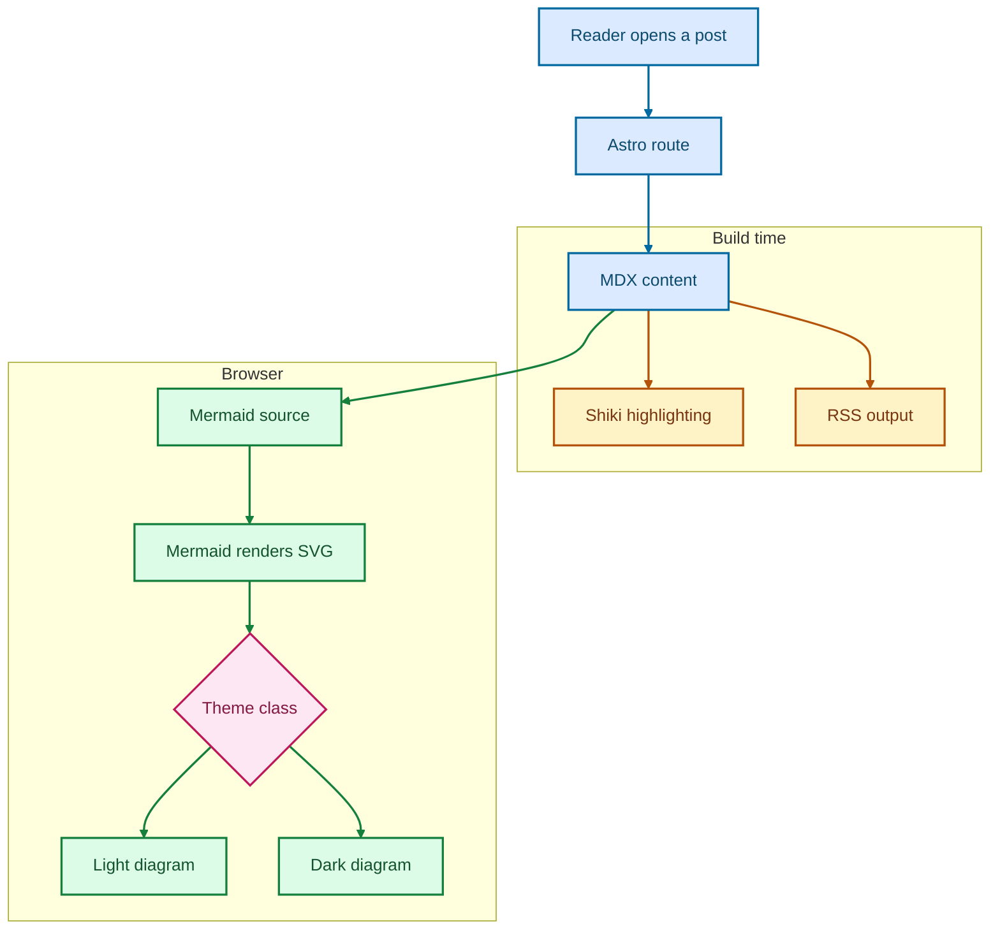

import Mermaid from "../../components/Mermaid.astro";

This post is a compact reference for the Markdown features used by the site: _emphasis_, **strong text**, ~~strikethrough~~, [links](https://www.mroy.me), and inline `code`.

## Table of contents

## Paragraphs and quotes

Paragraphs remain pleasantly boring: write prose in separate blocks and the browser takes care of the rest.

> A blockquote is useful when the source matters as much as the point.

## Lists

- An unordered item
- Another item
  - A nested item
  - One more nested item

1. First ordered item
2. Second ordered item
3. Third ordered item

- [x] A finished task
- [ ] A task still in progress

## Table

| Feature                  | Syntax           | Check  |
| ------------------------ | ---------------- | ------ |
| Inline code              | Backticks        | `true` |
| Code fence               | Triple backticks | `true` |
| Theme-aware highlighting | Shiki            | `true` |

## Image


## Code blocks

### TypeScript

```ts
type Post = {
  title: string;
  published: Date;
};

const formatTitle = (post: Post) => post.title.toUpperCase();
```

### Shell

```bash
pnpm build
pnpm dev
```

### JSON

```json
{
  "theme": "system",
  "feed": "/rss.xml"
}
```

## Mermaid

### Diagram source



<Mermaid
  chart={`flowchart TB
  Reader[Reader opens a post] --> Route[Astro route]
  Route --> Content[MDX content]

subgraph build[Build time]
Content --> Highlight[Shiki highlighting]
Content --> Feed[RSS output]
end

subgraph browser[Browser]
Content --> Diagram[Mermaid source]
Diagram --> Render[Mermaid renders SVG]
Render --> Theme{Theme class}
Theme --> Light[Light diagram]
Theme --> Dark[Dark diagram]
end

classDef source fill:#dbeafe,stroke:#0369a1,color:#0c4a6e,stroke-width:2px
classDef build fill:#fef3c7,stroke:#b45309,color:#78350f,stroke-width:2px
classDef client fill:#dcfce7,stroke:#15803d,color:#14532d,stroke-width:2px
classDef choice fill:#fce7f3,stroke:#be185d,color:#831843,stroke-width:2px

class Reader,Route,Content source
class Highlight,Feed build
class Diagram,Render,Light,Dark client
class Theme choice

linkStyle 0,1 stroke:#0369a1,stroke-width:2px
linkStyle 2,3 stroke:#b45309,stroke-width:2px
linkStyle 4,5,6,7,8 stroke:#15803d,stroke-width:2px`}
/>

---

## HTML and footnotes

<details>
  <summary>Native HTML can live alongside Markdown.</summary>

This is useful for content that needs disclosure behaviour.

</details>

Footnotes work too.[^note]

[^note]: This note should appear at the end of the post.
